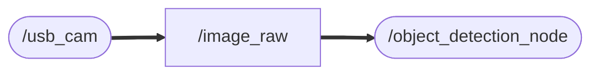

# object_detection_yolov8
ROS2上でYOLOv8（UltralyticsのPythonパッケージ）を動作させる
### Node and Topic

## Dependency
    sudo apt install ros-humble-info-manager

    sudo apt install ros-humble-publisher

## Setup
    cd ~/ros2_ws/src  #Go to ros workspace

    git clone https://github.com/iHaruruki/object_detection_yolov8.git #clone this package

    cd ~/ros2_ws

    colcon build --symlink-install

    source install/setup.bash

## Usage
    ros2 run usb_cam usb_cam_node_exe

    ros2 run object_detection_yolov8 object_detection_node

## License
## Authors
## References
